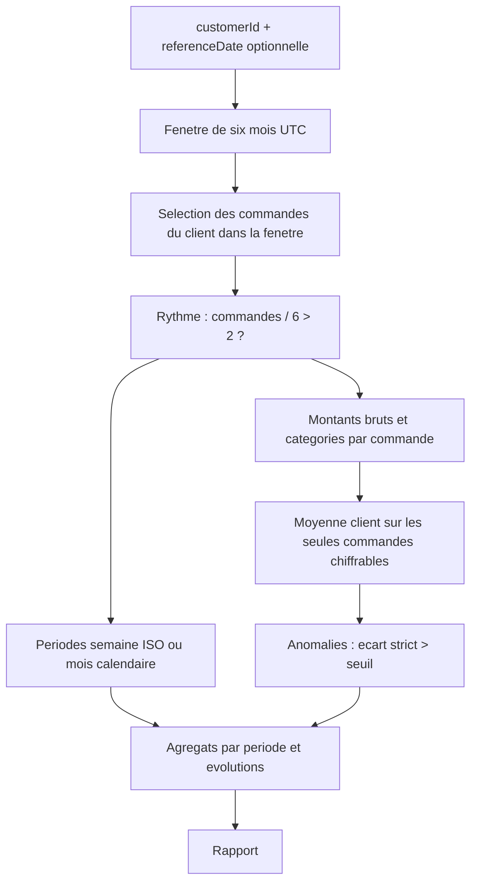
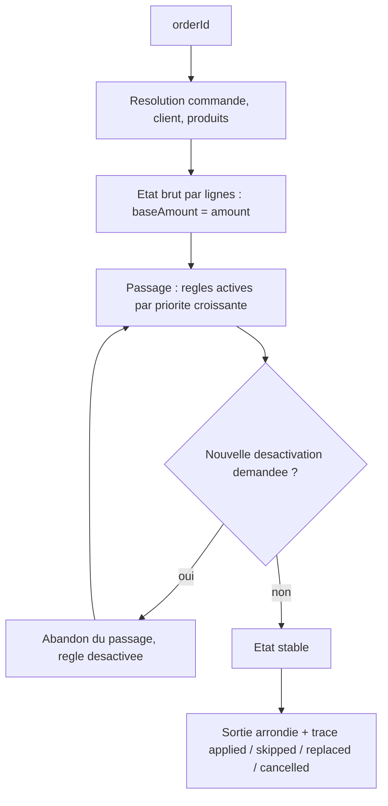

# Architecture du code

Ce document décrit l'architecture du code du test (Questions 1 et 2, CLI, interface). L'architecture du portail unifié de la Question 3 est traitée séparément dans [`QUESTION_3_PORTAIL_UNIFIE.md`](QUESTION_3_PORTAIL_UNIFIE.md).

## Objectifs

- séparer strictement données, domaine et présentation ;
- tester toute la logique métier sans navigateur (Vitest en environnement Node) ;
- rendre les Questions 1 et 2 utilisables à l'identique par la CLI et par React ;
- rendre les anomalies de données **explicites** : rien n'est corrigé ni ignoré silencieusement.

## Couches

### Domaine — `src/domain/`

Cœur métier, sans dépendance à React, à Zod ni à Node :

- `model.ts` — entités normalisées (`Customer`, `Product`, `Order`, `OrderItem`), en lecture seule, dates déjà parsées, prix numériques ;
- `errors.ts` — erreurs métier explicites (`UnknownCustomerError`, `UnknownProductError`, `UnknownOrderError`, `DuplicateIdError`, `InvalidDataError`, `RuleEngineError`) ;
- `calculateGrossOrderAmount.ts` — montant brut `Σ prix × quantité` et catégories d'une commande. Placé **directement dans `domain/`** car partagé par les deux questions : un import `customer-history → pricing` laisserait croire que la Q1 dépend de la Q2 ;
- `rounding.ts` — arrondi commercial à deux décimales, partagé, appliqué uniquement à l'exposition des valeurs ;
- `customer-history/` — fenêtre glissante et périodes (`periods.ts`, UTC exclusivement), génération du rapport (`generateCustomerHistory.ts`), types du rapport ;
- `pricing/` — moteur générique (`engine.ts`), règles de l'énoncé (`rules/`, un fichier par famille), calcul complet (`calculateOrderPrice.ts`), types.

### Infrastructure de données — `src/infrastructure/data/`

Frontière nette entre validation et normalisation :

- `schemas.ts` — Zod valide **la forme brute uniquement**, permissive là où les données le sont (prix en chaîne, type client absent, `express_delivery` absent). Aucune coercition, aucun `.default()`, aucun `.transform()` : une normalisation cachée dans un schéma serait invisible, donc intraçable et intestable. Une structure réellement invalide lève `InvalidDataError` ;
- `normalizeData.ts` — toutes les conversions **explicites** vers les modèles du domaine, chacune produisant un `DataIssue` ;
- `dataIssues.ts` — type `DataIssue` (code fermé, sévérité dérivée du code, entité, champ, valeur source) : une valeur métier retournée, jamais un log ;
- `loadData.ts` — imports JSON statiques (mêmes fichiers sous Vite, Vitest et tsx, sans `fs` ni `fetch`), index par identifiant avec rejet des doublons, contrôle d'intégrité référentielle (références inconnues **conservées** et signalées).

Séparer validation et normalisation donne deux garanties : chaque écart entre la donnée source et le modèle est tracé et testé individuellement, et la politique de données peut évoluer sans toucher aux schémas de forme.

### Présentation — `scripts/` et `src/presentation/`

- **CLI** (`scripts/`) : deux commandes (`history`, `pricing`), parsing d'arguments minimal, sortie humaine ou JSON pur, codes de sortie distincts (2 argument invalide, 1 erreur métier, 0 succès) ;
- **React** (`src/presentation/`) : deux pages appelant `loadData`, `generateCustomerHistory` et `calculateOrderPrice`, plus du formatage.

Aucune des deux couches ne recalcule quoi que ce soit : montants, anomalies, rythmes et règles proviennent exclusivement du domaine. Les deux couches ne s'importent pas entre elles.

## Flux — Question 1

Le rythme compte **toutes** les commandes de la fenêtre, y compris non chiffrables : il mesure une fréquence d'achat, pas la qualité des données de prix. Les statistiques monétaires, elles, excluent les montants `null`.

## Flux — Question 2

Propriétés du moteur :

- **état immutable** : chaque règle retourne un nouvel état, l'état reçu n'est jamais muté ;
- **total dérivé** des lignes et des ajustements de commande, jamais stocké — impossible qu'il diverge du contenu réel ;
- **désactivations monotones** : une règle annulée ou remplacée ne redevient jamais active pendant le même calcul, ce qui garantit la terminaison (une réévaluation naïve oscillerait : la règle conditionnelle redeviendrait applicable dès que le calcul repart sans elle) ;
- **ordre stable** : priorité croissante, l'index de déclaration départageant les égalités ;
- **garde-fou de convergence** : au-delà du plafond de passages (10 par défaut), `RuleEngineError` — jamais de non-convergence masquée ;
- **instantané après règles de base** : le palier 1000 est évalué *avant* le palier 500 (priorités 210/220) pour que les deux seuils voient le même montant, sans « dé-réduction ».

## Choix structurants

| Décision | Motivation | Compromis |
|---|---|---|
| Imports JSON statiques | Même code de chargement sous Vite, Vitest et tsx ; aucun `fs`/`fetch` ; sources en lecture seule | Le dataset est figé au build ; suffisant pour le test |
| Zod uniquement à la frontière | Le domaine ignore la forme brute ; la validation est centralisée et remplaçable | Types « raw » et types domaine à maintenir en parallèle |
| UTC sans bibliothèque de dates | `date-fns` et `Date` natif travaillent en fuseau local par défaut — exactement le piège à éviter ; ~60 lignes suffisent | Code de calendrier maison à tester (il l'est : clamping, ISO, année longue) |
| Domaine fonctionnel (fonctions pures, pas de classes) | Testable sans mock, composable, sans état partagé | Pas d'encapsulation objet ; discipline d'immutabilité requise |
| Moteur générique + registre de règles | L'énoncé annonce des règles changeantes ; ajouter une règle n'exige pas de toucher au moteur | Une indirection de plus que du code impératif direct |
| Pas de backend pour Q1/Q2 | Rien dans l'énoncé ne le demande ; le domaine est agnostique | Un vrai produit ajouterait une API devant le domaine |
| CLI et React sur le même domaine | Deux vérifications indépendantes du même code ; aucune logique dupliquée | Deux couches d'E/S à maintenir |
| Erreurs bloquantes vs `DataIssue` | Ambiguïté insoluble (doublon, structure invalide) → erreur ; anomalie récupérable → valeur signalée et traitée | Deux chemins d'échec à documenter et tester |

## Extensibilité

Points d'extension réels — une modification de code est nécessaire, mais localisée :

- **nouvelle catégorie taxable** : ajouter une règle dans `rules/categoryRules.ts` (constantes taux/catégorie, prédicat de ligne) et l'inscrire dans `rules/index.ts` avec une priorité 3xx. Si plusieurs taux peuvent se chevaucher, étendre le prédicat d'exclusion comme le fait déjà la règle Alimentaire vis-à-vis d'Électronique ;
- **nouveau seuil conditionnel** (ex. > 2000 € : −10 %) : ajouter une règle dans `conditionalRules.ts` avec une priorité *inférieure* aux paliers qu'elle remplace (le plus haut seuil s'évalue en premier) et déclarer le remplacement des paliers inférieurs ;
- **promotion saisonnière** : nouvelle règle avec `isApplicable` sur la date de commande, insérée dans la famille correspondant à son assiette (base pour un pourcentage global, catégorie pour un produit) ; le paramètre `rules` de `calculateOrderPrice` permet aussi d'injecter un registre alternatif sans toucher au registre par défaut ;
- **nouveau regroupement de périodes** (ex. par quinzaine) : ajouter un générateur dans `periods.ts` (mêmes garanties : continuité, bords partiels, clés stables) et brancher le choix dans `generateCustomerHistory`.

## Tests

Six fichiers, calqués sur les couches : normalisation et chargement (fixtures invalides comprises), périodes (bornes, clamping, ISO, fuseaux), montant brut et catégories, rapport d'historique (données réelles + fixtures synthétiques ciblées), moteur générique (règles jouets couvrant ordre, annulation, monotonie, convergence), règles métier et calcul complet (valeurs réelles du dataset + seuils exacts en synthétique). Les cas non atteignables par le dataset — l'annulation du palier 500 par la remise de volume, notamment — sont couverts par des fixtures synthétiques explicites.

## Décisions non retenues

- **backend / base de données / Docker** : aucune exigence de l'énoncé ne les justifie ; le dataset est local et immuable ;
- **repository pattern** : une seule source de données, immuable — l'abstraction n'aurait pas de deuxième implémentation ;
- **conteneur d'injection de dépendances** : les fonctions reçoivent leurs entrées en paramètres ; l'injection existe déjà, sans framework ;
- **React Router** : deux onglets gérés par un état local ; un routeur n'apporterait que du poids ;
- **bibliothèque de dates** : voir le tableau des choix — le fuseau local par défaut de ces bibliothèques est précisément le risque ;
- **bibliothèque monétaire / décimale** : les calculs restent en pleine précision `number` et l'arrondi n'intervient qu'à l'exposition ; les tests verrouillent les cas limites (`1.005`, seuil `500.004`), une bibliothèque décimale serait disproportionnée ici.
