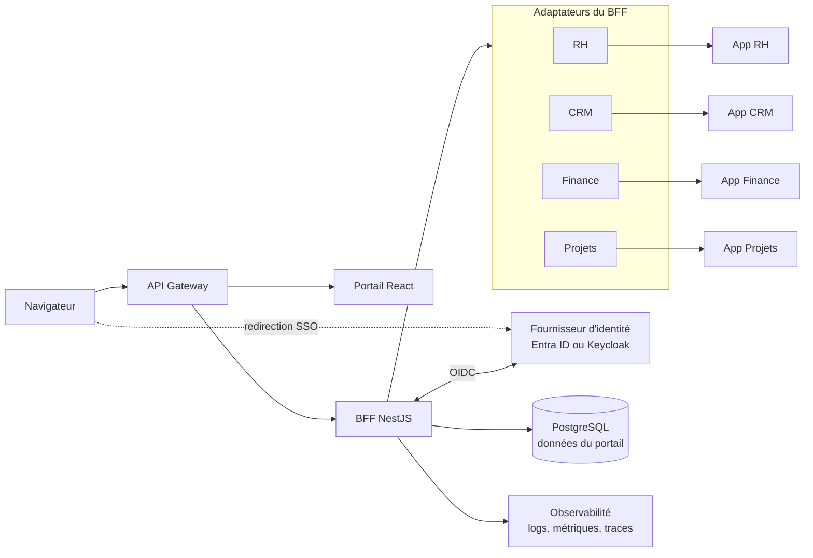
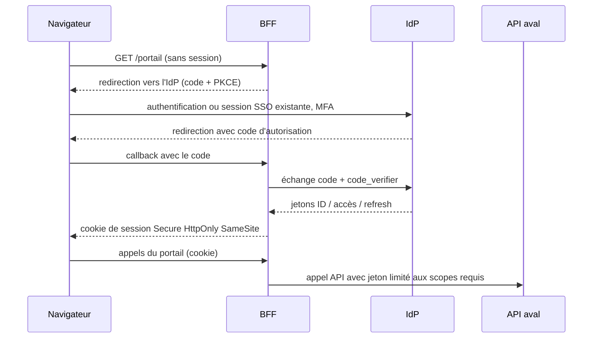

# Question 3 — Architecture d'un portail unifié

Dashboard unifié donnant accès aux services métiers de l'entreprise : App RH (employés, congés, paies), App CRM (clients, opportunités, devis), App Finance (comptabilité, factures, reporting) et App Projets (tâches, planning, timetracking).

## Position architecturale

Le portail **ne remplace pas** les quatre applications existantes. Il fournit, progressivement : un point d'entrée unique, une authentification unique, une navigation cohérente, des liens profonds vers les applications, puis des widgets agrégés lorsque des APIs le permettent — le tout au travers d'une couche d'intégration qui préserve l'autonomie de chaque application.

Chaque application reste **source de vérité pour son propre domaine**. Le portail ne se connecte jamais directement à leurs bases de données : toute donnée métier transite par une API. Ce principe est le plus structurant du document ; presque tous les choix qui suivent en découlent.

## Hypothèses

L'énoncé ne décrit ni l'infrastructure ni l'existant technique. Les choix ci-dessous reposent donc sur des hypothèses explicites ; chacune indique ce qui changerait si elle était fausse.

| Hypothèse | Si elle est fausse |
|---|---|
| Le portail sert principalement des collaborateurs internes (centaines à quelques milliers d'utilisateurs). | Un usage externe (clients, partenaires) imposerait une gestion d'identités externes (CIAM), un durcissement réseau et une revue du dimensionnement. |
| Les quatre applications sont déployées et gérées indépendamment, par des équipes distinctes. | Si une seule équipe possède tout, certaines couches d'isolation (adaptateurs séparés) peuvent être simplifiées. |
| Un fournisseur d'identité d'entreprise existe probablement déjà (annuaire, messagerie, SSO partiel). | Sans IdP existant, en déployer un devient le premier chantier — Keycloak est alors le candidat par défaut. |
| Certaines applications exposent des APIs modernes, d'autres sont historiques. | Si les quatre sont modernes et OIDC, la phase d'intégration se raccourcit ; si aucune ne l'est, la phase 2 se décale au profit du proxy transitoire. |
| L'entreprise a déjà des standards d'hébergement (cloud ou on-premise) qu'il faut privilégier. | Sans standard, choisir la plateforme managée la plus simple opérée par l'équipe la plus disponible. |
| Aucune réécriture des applications existantes n'est envisagée à court terme. | Si une réécriture est déjà planifiée, l'intégration de cette application peut viser directement sa future API. |

## Vue d'ensemble

Deux couches distinctes à ne pas confondre : le **gateway** traite les préoccupations réseau transverses (TLS, rate limiting, routage) ; le **BFF** adapte et agrège les données pour les écrans du portail. Les quatre applications restent en bout de chaîne, inchangées.

## Frontend du portail

**Stack : React, TypeScript, Vite, React Router, TanStack Query.**

React et TypeScript sont un standard de fait pour lequel le recrutement, l'outillage et la documentation sont les plus disponibles ; si l'entreprise a déjà un autre standard frontend maîtrisé, c'est lui qu'il faut retenir — le reste de l'architecture n'en dépend pas. Vite fournit le build et le serveur de développement sans configuration lourde. React Router gère les routes réelles du portail (catalogue, dashboard, préférences, pages par domaine). TanStack Query prend en charge l'état serveur : cache par requête, invalidation, états de chargement et d'erreur par widget — précisément ce dont un dashboard agrégé a besoin, sans store global.

**Une SPA suffit.** Le portail est une application interne, derrière authentification : il n'y a ni référencement, ni exigence de premier rendu sur réseau inconnu — les deux motivations habituelles du rendu serveur. Le SSR ajouterait un runtime de rendu à opérer et une classe de bugs (hydratation) sans bénéfice mesurable pour ce public. Il redeviendrait pertinent si le portail devait un jour servir des pages publiques.

L'interface utilise le design system interne s'il existe, sinon une bibliothèque de composants accessibles ; l'accessibilité (navigation clavier, contrastes) est un prérequis pour un outil utilisé quotidiennement par tous les collaborateurs.

**Aucun jeton d'accès n'est stocké dans le navigateur** — ni localStorage, ni sessionStorage. Un jeton lisible par JavaScript est exfiltrable par la première faille XSS venue. Le navigateur ne détient qu'un cookie de session opaque ; les jetons vivent côté serveur, dans le BFF. C'est l'orientation du draft IETF « OAuth 2.0 for Browser-Based Applications », qui présente le BFF comme l'architecture la plus sûre pour les applications navigateur.

## Backend for Frontend

**Stack : Node.js, TypeScript, NestJS, OpenAPI.**

Le BFF est la seule façade que le frontend connaît. NestJS apporte une structure de modules et d'injection de dépendances qui se prête bien à un service composé d'adaptateurs, ainsi qu'une génération OpenAPI intégrée — chaque endpoint du BFF est documenté et testable contractuellement. Node.js/TypeScript aligne le langage avec le frontend, ce qui compte pour une petite équipe portail.

Le BFF contient :

- **un adaptateur par application** (RH, CRM, Finance, Projets), isolant le format, l'authentification et les particularités de chaque API en aval ; un changement dans l'API RH ne touche que l'adaptateur RH ;
- **une couche d'agrégation** qui compose les réponses à la forme des écrans du portail (un appel du dashboard peut interroger plusieurs adaptateurs en parallèle) ;
- **la gestion des sessions et des jetons** (section SSO) ;
- **des timeouts et circuit breakers par adaptateur**, pour qu'une application lente ou en panne dégrade son widget et rien d'autre.

Le BFF est une couche d'**orchestration et d'adaptation**. Il ne recopie pas la logique métier des applications : il ne calcule pas un solde de congés, il l'affiche. Si une règle métier semble devoir vivre dans le BFF, c'est le signe qu'une API manque dans l'application concernée.

## SSO et identité

### Choix du fournisseur d'identité

**Décision : réutiliser l'IdP d'entreprise existant, ne pas en construire un.** L'identité des collaborateurs (arrivées, départs, MFA, politiques de sécurité) est déjà gérée quelque part ; la dupliquer créerait un deuxième référentiel à synchroniser et un deuxième endroit où un compte oublié reste actif.

- **Microsoft Entra ID** est l'implémentation de référence si l'entreprise utilise Microsoft 365/Azure — cas le plus fréquent : les comptes, groupes et politiques MFA existent déjà.
- **Keycloak** est l'alternative si l'entreprise veut une solution auto-hébergée ou indépendante d'un fournisseur cloud : open source, OIDC et SAML natifs, fédération LDAP/AD.

Le reste de l'architecture est volontairement neutre : elle fonctionne à l'identique avec l'un ou l'autre.

### Protocoles

- **OpenID Connect** pour le portail et les applications modernes ;
- **OAuth 2.0 Authorization Code Flow avec PKCE** (RFC 7636) pour l'obtention des jetons ;
- **SAML 2.0** uniquement comme mécanisme de compatibilité avec les applications historiques qui ne parlent pas OIDC ;
- le **flux implicite n'est pas utilisé** : il expose les jetons dans l'URL et est déprécié par les recommandations actuelles de l'IETF.

### Flux de connexion

Points fermes de ce flux : les **jetons ne quittent jamais le serveur** ; le navigateur ne reçoit qu'un cookie `Secure`, `HttpOnly`, `SameSite` ; le BFF appelle les APIs avec des jetons **limités aux scopes nécessaires** ; et chaque application **continue d'appliquer ses propres autorisations métier** — le SSO authentifie, il n'autorise pas.

Masquer un bouton dans le portail n'est **jamais** un contrôle d'autorisation : c'est du confort d'interface. La décision d'accès se prend côté API et côté application, sur chaque requête.

## Intégration des quatre applications

L'énoncé ne précise pas les capacités techniques de chaque application ; trois cas couvrent la réalité probable.

**Cas 1 — application compatible OIDC avec APIs.** Intégration native à l'IdP : l'utilisateur bénéficie du SSO en lien profond, et le BFF appelle ses APIs pour les widgets. C'est la cible pour toutes les applications, à terme.

**Cas 2 — application compatible SAML mais pas OIDC.** Fédération SAML avec **le même IdP** : une seule identité, deux protocoles. Le SSO par lien profond fonctionne ; si une vue agrégée est requise, un adaptateur API reste nécessaire (SAML ne fournit pas d'accès API, seulement l'authentification web).

**Cas 3 — application historique sans fédération correcte.** Solution transitoire : reverse proxy ou identity-aware proxy qui authentifie l'utilisateur contre l'IdP avant de laisser passer la requête, en attendant une modernisation planifiée. Ligne rouge absolue : **ne jamais stocker ni rejouer les mots de passe des utilisateurs** pour simuler une connexion.

**Pourquoi pas des iframes.** Intégrer les applications en iframe semble rapide mais cumule les problèmes : politiques CSP et `frame-ancestors` à affaiblir, exposition au clickjacking, double navigation (celle du portail et celle de l'application encadrée), sessions et cookies tiers de plus en plus bloqués par les navigateurs, accessibilité dégradée, et couplage fort avec des interfaces qu'on ne contrôle pas. Le lien profond avec SSO donne un résultat plus honnête : l'utilisateur sait où il est, et chaque application garde son cycle de vie.

## Autorisation

- **RBAC** fondé sur les rôles et groupes de l'IdP : le portail lit les groupes (« RH », « Finance », « Manager »…) pour composer la navigation et les widgets visibles.
- **Scopes OAuth par API** : le jeton que le BFF présente à l'App RH ne porte que les scopes RH nécessaires, pas un accès générique.
- **Contrôles côté API et côté application**, systématiquement — jamais uniquement côté interface.
- **ABAC** en complément lorsque des règles contextuelles s'imposent (un manager ne voit que son équipe) ; inutile de le généraliser d'emblée.
- **Moindre privilège** par défaut : un rôle n'obtient que ce que son besoin justifie.

Les trois niveaux restent séparés : l'**authentification** (qui est là) relève de l'IdP ; l'**autorisation globale** (qui voit quel widget) relève du portail via RBAC ; l'**autorisation métier** (qui voit quelle donnée) relève de chaque application. Exemple : un responsable RH voit le widget des congés ; cela ne lui ouvre pas les fiches de paie — c'est l'App RH qui prend la décision finale, requête par requête.

## Données et stockage

Le portail ne possède que **ses propres données** : préférences utilisateur, configuration des widgets, favoris, métadonnées de navigation, et l'audit technique de ses propres actions.

- **PostgreSQL** pour ces données : relationnel éprouvé, sauvegardes et opérations bien connues, largement suffisant pour cette volumétrie.
- **Redis** uniquement si un besoin réel apparaît : sessions distribuées quand le BFF passe à plusieurs instances, ou cache court partagé. Pas de Redis « par principe ».
- **Aucun accès direct aux bases RH, CRM, Finance ou Projets**, et **aucun entrepôt de duplication généralisé** en première version : dupliquer les données métier créerait une deuxième vérité, avec ses écarts et sa gouvernance.

Les informations métier sont obtenues par APIs à la demande. Pour les données lentes ou coûteuses (un reporting Finance, par exemple), un **cache à TTL court avec invalidation explicite** est acceptable : la fraîcheur perdue est bornée et affichable (« données de 10 h 42 »).

## API gateway et réseau

Un gateway ou reverse proxy est placé devant le portail et le BFF pour : la terminaison TLS, la validation de jetons en défense en profondeur, le rate limiting, le routage, la journalisation d'accès, les quotas et les politiques CORS centralisées.

Le produit dépend de l'environnement, qu'on ne connaît pas ici : **Azure API Management** dans un environnement Microsoft/Azure ; **Kong, NGINX** ou la solution déjà standardisée dans un environnement agnostique. Imposer un produit sans connaître l'existant serait une fausse précision — la fonction prime.

La frontière avec le BFF reste nette : le gateway traite des préoccupations **réseau et transverses**, identiques pour tous les services ; le BFF traite des préoccupations **fonctionnelles**, propres aux écrans du portail. Fusionner les deux produit soit un gateway intelligent impossible à généraliser, soit un BFF surchargé de configuration réseau.

## Déploiement

Approche proportionnée à un portail interne :

- **images Docker**, frontend et BFF **déployables indépendamment** ;
- plateforme de conteneurs **managée ou déjà standard en interne** ; **Kubernetes uniquement si l'entreprise le maîtrise déjà** et si le besoin (échelle, multi-équipes) le justifie — un portail interne ne le justifie pas à lui seul ;
- environnements **développement, intégration, préproduction, production** ;
- **infrastructure as code** (Terraform ou l'outil maison) ;
- secrets dans un **secret manager** (Azure Key Vault, Vault…) — **aucun secret dans Git ni dans le frontend**.

CI/CD (GitHub Actions, GitLab CI ou le système existant) : typecheck, lint, tests unitaires, tests d'intégration, **tests de contrat** contre les adaptateurs (ils détectent les changements d'API aval avant la production), tests E2E Playwright sur les parcours critiques (connexion SSO comprise), analyse de dépendances, et déploiement en production **avec approbation**.

## Observabilité

- **logs structurés** avec correlation ID propagé du navigateur jusqu'aux adaptateurs ;
- **métriques** (latence par adaptateur, taux d'erreur, sessions actives) ;
- **traces distribuées OpenTelemetry**, standard neutre qui s'exporte vers la plateforme de supervision existante quelle qu'elle soit ;
- **audit** des connexions et actions sensibles ;
- tableaux de bord et alertes sur les indicateurs qui déclenchent une action ;
- **aucune donnée personnelle ni jeton dans les logs**.

La dégradation partielle est un comportement de conception, pas un accident : si l'App Finance est indisponible, le circuit breaker de l'adaptateur Finance s'ouvre, le widget Finance affiche une erreur isolée avec l'heure de la dernière donnée connue, et le reste du portail — RH, CRM, Projets, navigation — fonctionne normalement. Le tableau de bord ne meurt jamais de la panne d'une seule application.

## Sécurité

TLS partout, y compris en interne. Cookies `Secure`, `HttpOnly`, `SameSite` ; protection CSRF sur toutes les mutations (la session par cookie l'exige) ; CSP stricte ; validation des entrées et encodage des sorties ; rate limiting au gateway ; rotation des secrets ; sessions courtes et révocables côté BFF ; **MFA gérée par l'IdP**, pas réimplémentée ; moindre privilège sur les scopes et les rôles ; audit ; revue continue des dépendances ; séparation stricte des environnements.

Aucune technologie de cette liste ne rend le système « sécurisé » à elle seule : la sécurité résulte du cumul de ces contrôles, de leur supervision, et de leur remise en question régulière.

## Approche progressive

**Phase 1 — Point d'entrée et SSO.** Portail avec catalogue des applications, identité centralisée sur l'IdP, liens profonds SSO, RBAC de base pour la visibilité des entrées. Aucun changement profond dans les applications. Valeur immédiate : une seule connexion, un seul point de départ.

**Phase 2 — Données agrégées.** BFF et premiers adaptateurs sur les APIs disponibles, premiers widgets (congés en attente, opportunités en cours, factures à valider, tâches du jour), gestion des indisponibilités par widget, observabilité et audit renforcés.

**Phase 3 — Expériences réellement unifiées.** Parcours transverses (préparer une facture depuis une opportunité gagnée), notifications agrégées, recherche multi-applications, éventuels événements asynchrones entre applications. **Microfrontends uniquement si un besoin est démontré** : ils ne se justifient que si plusieurs équipes doivent livrer indépendamment des portions intégrées du portail, avec des cycles réellement autonomes. Ce n'est pas le choix initial par défaut — pour une équipe portail unique, ils n'apportent que de la complexité de build et de version.

## Alternatives écartées

| Alternative | Pourquoi elle n'est pas retenue par défaut |
|---|---|
| Réécrire les quatre applications | Coût et risque massifs, valeur différée de plusieurs années ; le portail apporte l'unification sans ce pari. |
| Base de données commune | Détruit l'autonomie et la propriété des données ; couple les cycles de vie de cinq systèmes ; migration à hauts risques. |
| Appeler toutes les APIs depuis le navigateur | Multiplie les problèmes de CORS et surtout expose les jetons de chaque API au navigateur ; le BFF existe précisément pour éviter cela. |
| Jetons dans localStorage | Lisibles par tout script injecté (XSS) ; contraire aux recommandations IETF actuelles pour les applications navigateur. |
| Tout intégrer en iframes | CSP, clickjacking, double navigation, cookies tiers bloqués, accessibilité — détaillé plus haut. |
| Microfrontends immédiats | Complexité de build, de versionnement et de runtime sans bénéfice tant qu'une seule équipe livre le portail. |
| Kubernetes « parce que c'est populaire » | Coût opérationnel permanent ; justifié par la maîtrise et le besoin, pas par la popularité. |

## Décisions et compromis

| Décision | Choix | Justification | Compromis |
|---|---|---|---|
| Type de frontend | SPA React, sans SSR | Portail interne authentifié : ni SEO, ni premier rendu critique | Premier chargement un peu plus lourd ; SSR à reconsidérer si pages publiques |
| Couche serveur | BFF NestJS | Jetons côté serveur, agrégation adaptée aux écrans, un adaptateur par application | Un service de plus à opérer et à surveiller |
| Identité | IdP d'entreprise existant (Entra ID, sinon Keycloak) | Comptes, MFA et cycle de vie déjà gérés ; pas de deuxième référentiel | Dépendance à l'équipe qui opère l'IdP |
| Protocole principal | OIDC + Authorization Code + PKCE | Standard actuel, adapté aux clients publics et confidentiels ; flux implicite écarté | Configuration initiale plus exigeante qu'un SSO « maison » |
| Applications historiques | SAML 2.0 en compatibilité, proxy transitoire sinon | Une seule identité même pour le legacy ; pas de rejeu de mots de passe | Maintien temporaire de deux protocoles ; dette à résorber |
| Données du portail | PostgreSQL limité aux données propres | Le portail ne duplique aucune donnée métier ; chaque app reste source de vérité | Dépendance à la disponibilité des APIs aval ; caches courts à gérer |
| Intégration | Progressive en trois phases | Valeur livrée dès la phase 1 ; le risque technique croît avec la valeur démontrée | L'expérience « totalement unifiée » n'arrive qu'en phase 3 |
| Microfrontends | Absents de la phase 1 | Une équipe portail unique n'en tire aucun bénéfice | Refactoring ultérieur si plusieurs équipes doivent livrer dans le portail |

## Questions à poser avant l'implémentation

1. Quel fournisseur d'identité est déjà en place, et qui l'opère ?
2. Quels protocoles (OIDC, SAML, rien) chaque application supporte-t-elle réellement ?
3. Quelles APIs existent, avec quelle qualité, quelle documentation et quels environnements de test ?
4. Quelle est l'infrastructure cible (Azure, autre cloud, on-premise) et ses standards ?
5. Quelles exigences de disponibilité pour le portail — et pour chaque widget ?
6. Quelle volumétrie d'utilisateurs et de requêtes est attendue ?
7. Quelle classification des données transitera par le portail (paies et finance sont sensibles) ?
8. Y a-t-il un besoin mobile réel (responsive suffisant, ou application dédiée) ?
9. Quelles contraintes réglementaires s'appliquent (RGPD, audit financier, rétention) ?
10. Qui possède chaque application, et avec quelle capacité à faire évoluer ses APIs ?
11. Comment le provisioning et la suppression des comptes sont-ils gérés aujourd'hui, et le seront-ils demain ?

## Références techniques

Sources officielles uniquement, vérifiées accessibles à la date de rédaction :

- [OpenID Connect Core 1.0](https://openid.net/specs/openid-connect-core-1_0-final.html) — spécification finale, OpenID Foundation.
- [RFC 7636 — Proof Key for Code Exchange by OAuth Public Clients](https://datatracker.ietf.org/doc/html/rfc7636) — IETF.
- [OAuth 2.0 for Browser-Based Applications](https://datatracker.ietf.org/doc/html/draft-ietf-oauth-browser-based-apps-26) — IETF. **Statut : Internet-Draft** (version 26, décembre 2025 ; une révision 27 est active), et non une RFC définitive ; ses recommandations, notamment le pattern BFF, font néanmoins consensus.
- [Microsoft identity platform — OAuth 2.0 authorization code flow](https://learn.microsoft.com/en-us/entra/identity-platform/v2-oauth2-auth-code-flow) — Microsoft Learn.
- [Keycloak — Server Administration Guide](https://www.keycloak.org/docs/latest/server_admin/) — documentation officielle Keycloak.
- [Azure Architecture Center — Backends for Frontends pattern](https://learn.microsoft.com/en-us/azure/architecture/patterns/backends-for-frontends) — Microsoft Learn.
